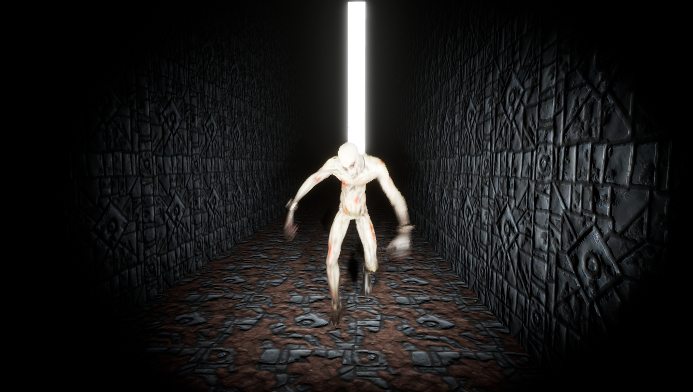

<b><h2>The girl with lights in her eyes</b></h2>

An horror game where you evolve in procedurally generated mazes, and where your eyes are the main mechanic:
- When opened, they light the way but the monsters will chase you. If they catch you, you are sent back to the beginning of the maze.
- When closed, the exit of the maze appears in the distance and the monsters stop chasing, but it is much harder to navigate.

The game has 7 successive levels, each one increasing the difficulty : bigger maze, higher number of monsters, limited time to finish the maze before dying...

<b>More details about the project:</b>
- Done using mostly C++ as a challenge and training, with the standard defined in https://docs.unrealengine.com/en-US/Programming/Development/CodingStandard/index.html
- Has procedurally generated mazes using a backtrack algorithm
- Uses AI based on Behaviour Trees and custom C++ behaviours
- Uses custom post-process effects
